# Spring Cloud Dataflow Example

In this example guide, we will:
1. Create custom [Spring Cloud Stream](https://cloud.spring.io/spring-cloud-stream/) apps  
2. Deploy stream apps to a Spring Cloud Dataflow server with Spring Cloud Skipper configured  
3. Use a CI/CD tool to automate building and deploying the stream apps on the SCDF server  

&nbsp;

## Getting Started

To get started, ensure you have the following
- [Java JDK 8](https://www.oracle.com/technetwork/java/javase/downloads/jdk8-downloads-2133151.html)
- [Docker Desktop](https://www.docker.com/products/docker-desktop) with lots of RAM (6GB+)

Ensure Docker Desktop has enough RAM.

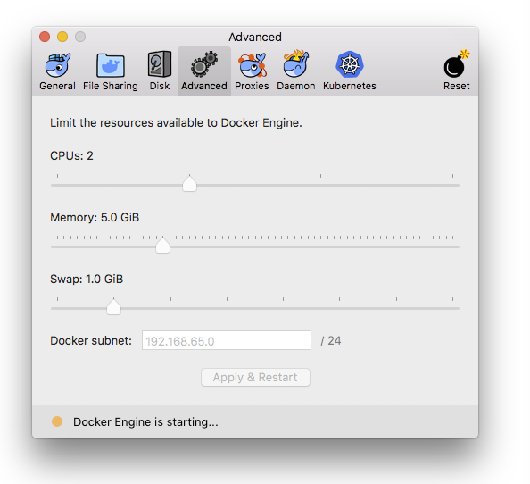

If you have access to a Spring Cloud Dataflow server, you may skip setting up a local Dataflow server. However, you will have to configure URLs in Concourse pipelines accordingly.

&nbsp;

## Setup a Local Spring Cloud Dataflow Environment

### 1. Start up a Dataflow server locally

For the purose of this guide, we'll use a pre-configured docker-compose.yml to run most of our local environment for Dataflow.  This docker-compose.yml is a modified version from the [official guide](https://cloud.spring.io/spring-cloud-dataflow/) with Spring Cloud Skipper added.  

This image will run the following:
- Spring Cloud Dataflow Server
- Spring Cloud Skipper
- Kafka Message Queue
- Apache Zookeeper

This will simulate a Dataflow server which is typically available as a tile on a PAS or a PKS instance.

Download [docker-compose.yml](docker-compose.yml) from this repo, and run it.

```
> wget https://github.com/pivotal-djoo/scdf-example/raw/master/docker-compose.yml
 
> DATAFLOW_VERSION=1.7.4.RELEASE docker-compose up
```

### 2. (Optional) Start SCDF Shell

Downlaod and run the Dataflow shell [jar](http://repo.spring.io/release/org/springframework/cloud/spring-cloud-dataflow-shell/1.7.4.RELEASE/spring-cloud-dataflow-shell-1.7.4.RELEASE.jar). It will automatically figure out how to talk to SCDF server.

```
> wget http://repo.spring.io/release/org/springframework/cloud/spring-cloud-dataflow-shell/1.7.4.RELEASE/spring-cloud-dataflow-shell-1.7.4.RELEASE.jar
  
> java -jar spring-cloud-dataflow-shell-1.7.4.RELEASE.jar --dataflow.mode=skipper
```

Once the shell boots up, you can type in commands such as `help` or `app list` to interact with the SCDF server.

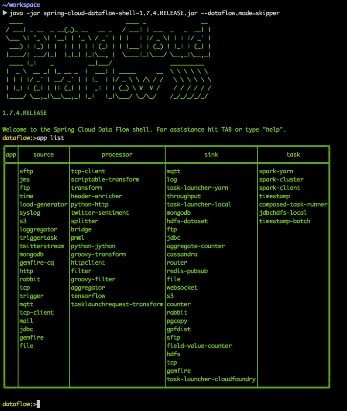

If you see `unknown>` instead of `dataflow>` in the shell prompt, that means something went wrong. Try stopping and removing all your docker containers, and trying again from step 1.

&nbsp;

## Create Spring Cloud Stream Apps 

Here we'll write some custom SC stream apps. A stream is composed of a series of apps which starts with a source and ends with a sink.

### 1. Source App

Create a Gradle Spring Boot project named `time-source` via [Spring Initializr](https://start.spring.io/). Add no dependencies.   

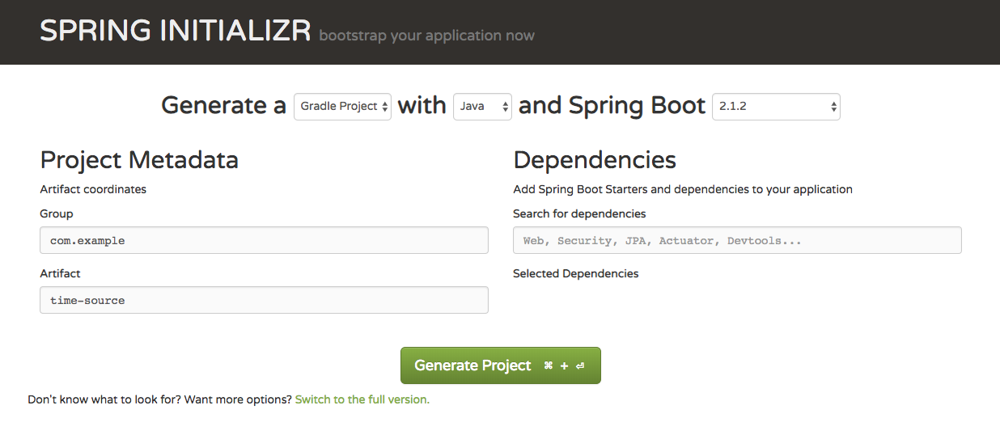  

Add `spring-cloud-starter-stream-kafka` as a dependency in build.gradle.

```
dependencies {
    compile 'org.springframework.boot:spring-boot-starter'
    compile 'org.springframework.cloud:spring-cloud-starter-stream-kafka:2.1.0.RELEASE'
    testImplementation 'org.springframework.boot:spring-boot-starter-test'
}
```
*Note I had to change `implementation` to `compile` to ensure Spring dependencies are present in the compiled jar file. 

Add `@EnableBinding(Source.class)` annotation to the main application class.

```
@EnableBinding(Source.class)
@SpringBootApplication
public class TimeSourceApplication {

    @Bean
    @InboundChannelAdapter(
            value = Source.OUTPUT,
            poller = @Poller(fixedDelay = "5000", maxMessagesPerPoll = "1")
    )
    public MessageSource<Long> timeMessageSource() {
        return () -> MessageBuilder.withPayload(new Date().getTime()).build();
    }

    public static void main(String[] args) {
        SpringApplication.run(
                TimeSourceApplication.class, args);
    }
}
```

Define a `@InboundChannelAdapter` to send a message to the source app's output channel.
```
@Bean
@InboundChannelAdapter(
        value = Source.OUTPUT,
        poller = @Poller(fixedDelay = "5000", maxMessagesPerPoll = "1")
)
public MessageSource<Long> timeMessageSource() {
    return () -> MessageBuilder.withPayload(new Date().getTime()).build();
}
```

To build the jar file run:

```
> ./gradlew build
```

### 2. Processor App

Create another Gradle Spring Boot project named `time-processor` via [Spring Initializr](https://start.spring.io/). Add no dependencies. 

Add `spring-cloud-starter-stream-kafka` as a dependency in build.gradle.

```
dependencies {
    compile 'org.springframework.boot:spring-boot-starter'
    compile 'org.springframework.cloud:spring-cloud-starter-stream-kafka:2.1.0.RELEASE'
    testImplementation 'org.springframework.boot:spring-boot-starter-test'
}
```
Change `implementation` to `compile` to ensure Spring dependencies are present in the compiled jar file. 

Add `@EnableBinding(Processor.class)` annotation to the main application class.

```
@EnableBinding(Processor.class)
@SpringBootApplication
public class TimeProcessorApplication {

    public static void main(String[] args) {
        SpringApplication.run(
                TimeProcessorApplication.class, args);
    }
}
```

Define a `@Transformer` to process the data coming in from the source app.

```
@Transformer(inputChannel = Processor.INPUT, 
  outputChannel = Processor.OUTPUT)
public Object transform(Long timestamp) {
 
    DateFormat dateFormat = new SimpleDateFormat("yyyy/MM/dd hh:mm:yy");
    String date = dateFormat.format(timestamp);
    return date;
}
```

To build the jar file run:

```
> ./gradlew build
```

### 3. Sink App

Create another Gradle Spring Boot project named `logging-sink` via [Spring Initializr](https://start.spring.io/). Add no dependencies. 

Add `spring-cloud-starter-stream-kafka` as a dependency in build.gradle.

```
dependencies {
    compile 'org.springframework.boot:spring-boot-starter'
    compile 'org.springframework.cloud:spring-cloud-starter-stream-kafka:2.1.0.RELEASE'
    testImplementation 'org.springframework.boot:spring-boot-starter-test'
}
```
Change `implementation` to `compile` to ensure Spring dependencies are present in the compiled jar file. 

Add `@EnableBinding(Sink.class)` annotation to the main application class.

```
@EnableBinding(Sink.class)
@SpringBootApplication
public class LoggingSinkApplication {

    public static void main(String[] args) {
        SpringApplication.run(
                LoggingSinkApplication.class, args);
    }
}
```

Define a `@StreamListener(Sink.INPUT)` to handle incoming messages from the processor application.

```
@StreamListener(Sink.INPUT)
public void loggerSink(String date) {
    logger.info("Received: " + date);
}
```

To build the jar file run:

```
> ./gradlew build
```

For development, I prefer importing each stream app projects as a module in a single Intellij window, resembling below.  

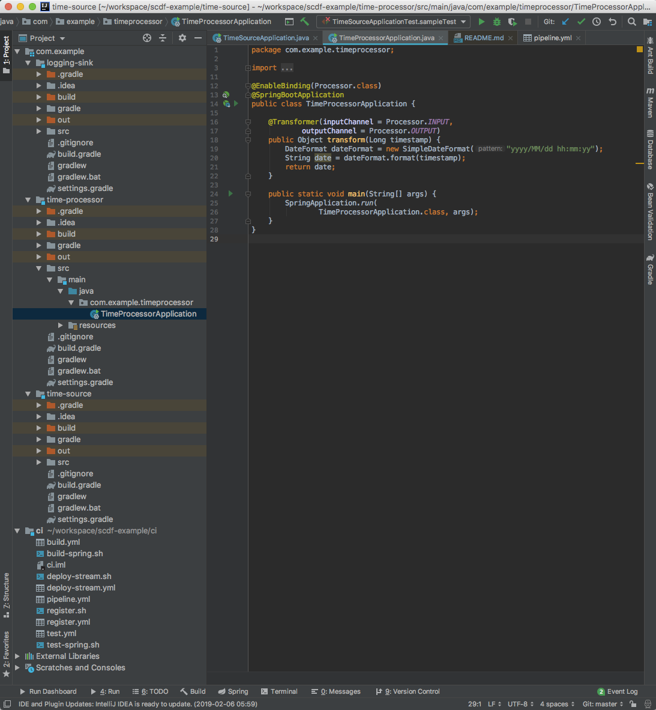

&nbsp;

## Make Stream Apps Available

There are a multiple approaches to making your stream app jars available to a Dataflow server. One method is to use [Artifactory](https://jfrog.com/artifactory/) to host jar files.

### 1. Run Artifactory OSS on Local Machine

Here, we'll use a free instance of [Artifactory OSS](https://jfrog.com/open-source/) on the localhost. If you have access to a hosted artifactory, you can skip this step.

```
> docker pull docker.bintray.io/jfrog/artifactory-oss:latest

> docker run --name artifactory -d -p 8081:8081 docker.bintray.io/jfrog/artifactory-oss:latest
```

If whatever reason the artifactory container has stopped, you can re-run it via the following command.
```
> docker run artifactory
```

The above will spin up an instance of Artifactory on [http://localhost:8081](http://localhost:8081).

### 2. Create repos for Stream Apps on Artifactory

Create a repository for each stream apps (time-source, time-processor, logging-sink)  

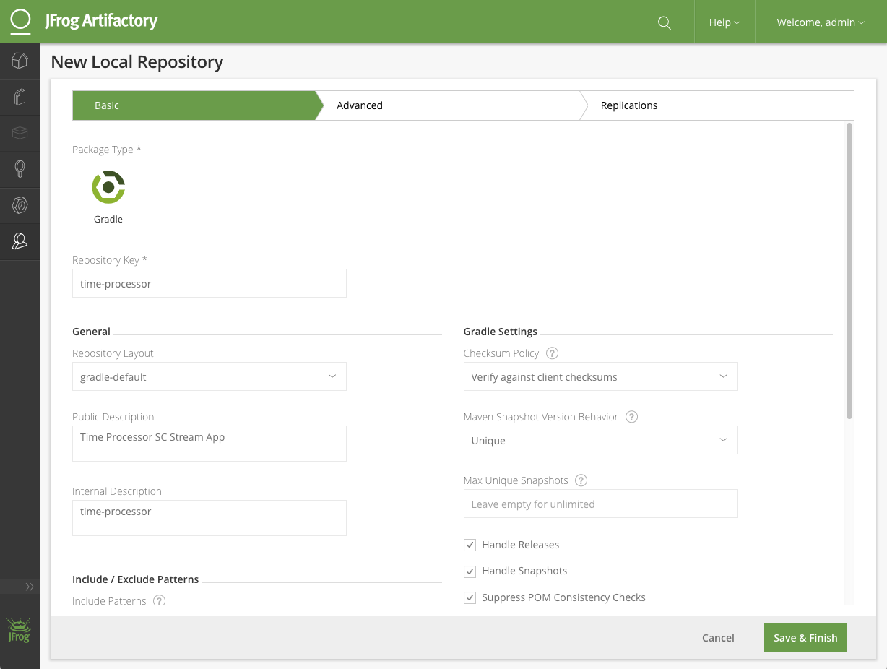

After creating repos for all three stream apps, the artifactory may look like the following.

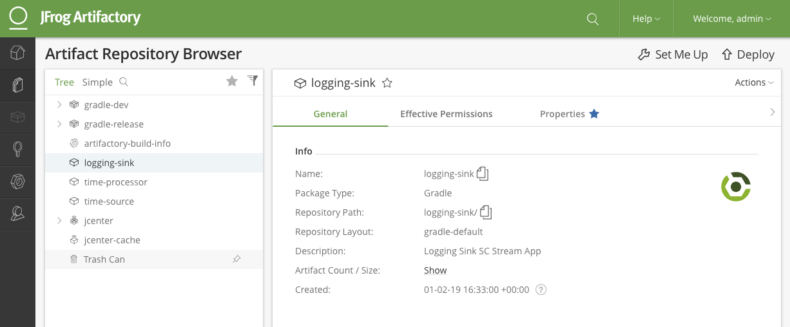

### 3. Push latest .jar files of each stream apps to respective repos on Artifactory

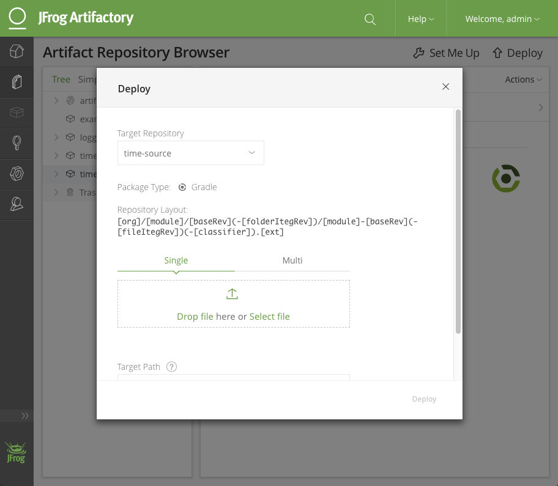

After uploading jars for all three stream apps, the artifactory may look like the following.

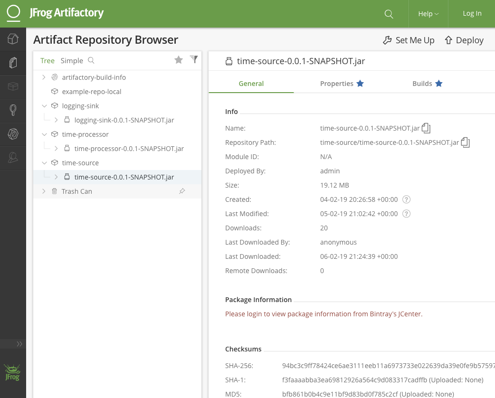

&nbsp;

## Setting up a Stream

We'll make use of Dataflow server's [REST API](https://docs.spring.io/spring-cloud-dataflow/docs/current/reference/htmlsingle/#api-guide) to manually register stream apps and deploy a stream. 

### 1. Register the Stream Apps on Local SCDF Server

The below will create three stream apps:
- `time-source`, type: `source`
- `time-processor`, type: `processor`
- `logging-sink`, type: `sink`

Reference: [Registering a New Application with Version](http://docs.spring.io/spring-cloud-dataflow/docs/1.7.4.RELEASE/reference/htmlsingle/#resources-app-registry-post-skipper)

```
> curl 'http://localhost:9393/apps/source/time-source/0.0.1.SNAPSHOT' -i -X POST -d \
    "uri=http://host.docker.internal:8081/artifactory/time-source/time-source-0.0.1-SNAPSHOT.jar"
 
> curl 'http://localhost:9393/apps/source/time-processor/0.0.1.SNAPSHOT' -i -X POST -d \
    "uri=http://host.docker.internal:8081/artifactory/time-processor/time-processor-0.0.1-SNAPSHOT.jar"
  
> curl 'http://localhost:9393/apps/source/logging-sink/0.0.1.SNAPSHOT' -i -X POST -d \
    "uri=http://host.docker.internal:8081/artifactory/logging-sink/logging-sink-0.0.1-SNAPSHOT.jar"
```

### 2. Create a Stream Using DSL and Deploy

The below will create a stream named `time-to-log` with stream DSL `time-source | time-processor | logging-sink`, and deploy.

Reference: [Creating a New Stream Definition](http://docs.spring.io/spring-cloud-dataflow/docs/1.7.4.RELEASE/reference/htmlsingle/#api-guide-resources-stream-definitions-create)

```
> curl "http://localhost:9393/streams/definitions" -i -X POST -d "name=time-to-log&definition=time-source | time-processor | logging-sink&deploy=true" 
```

### 3. More Stream Operations

[Undeploy a stream](http://docs.spring.io/spring-cloud-dataflow/docs/1.7.4.RELEASE/reference/htmlsingle/#api-guide-resources-stream-deployment-undeploy):
```
> curl 'http://localhost:9393/streams/deployments/time-to-log' -i -X DELETE
```

[Re-deploy a stream](http://docs.spring.io/spring-cloud-dataflow/docs/1.7.4.RELEASE/reference/htmlsingle/#api-guide-resources-stream-deployment-deploy):
```
> curl 'http://localhost:9393/streams/deployments/time-to-log' -i -X POST
```

[Delete a stream definition](http://docs.spring.io/spring-cloud-dataflow/docs/1.7.4.RELEASE/reference/htmlsingle/#api-guide-resources-stream-definitions-delete-one):
```
> curl 'http://localhost:9393/streams/definitions/time-to-log' -i -X DELETE
```

&nbsp;

Once finished deploying the stream, confirm the stream is deployed by navigating to Streams page on the Dataflow server's web interface.

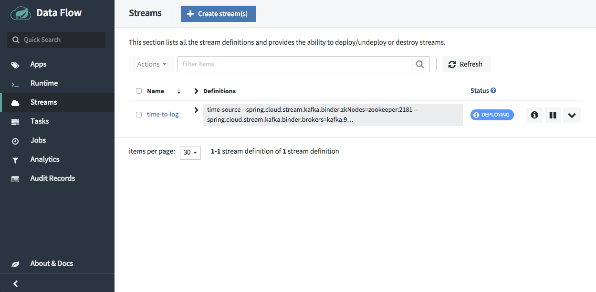  

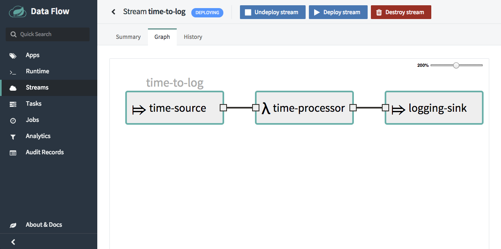

&nbsp;

## Verification

Verification can be possible by looking at the logs.

Copy the path to output log of a running stream app.

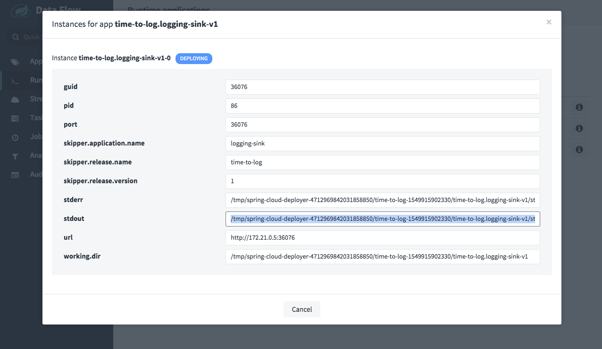

Print the logs on terminal in realtime.

```
> docker exec -it dataflow-server tail -f <COPIED-STDOUT-PATH>
```

&nbsp;

## Configure CI/CD

We'll use [Concourse](https://concourse-ci.org/) for CI/CD.

We'll once again leverage Dataflow server's [REST API](https://docs.spring.io/spring-cloud-dataflow/docs/current/reference/htmlsingle/#api-guide) to write Concourse tasks.

### 1. Run a local instance of Concourse  

```
> wget https://concourse-ci.org/docker-compose.yml

> docker-compose up
```

### 2. Download fly commandline tool

```
> wget -O /usr/local/bin/fly http://localhost:8080/api/v1/cli\?arch\=amd64\&platform\=darwin

> chmod +x /usr/local/bin/fly
```

### 3. Login to Concouse instance via terminal

```
> fly -t ci login -c http://localhost:8080 -u test -p test
```
 
### 4. Create a pipeline on Concourse

Download [pipeline.yml](ci/pipeline.yml) from this repo, and create a pipeline named `scdf-example`.

```
> wget https://github.com/pivotal-djoo/scdf-example/raw/master/ci/pipeline.yml

> fly -t ci set-pipeline -p scdf-example -c pipeline.yml
```

&nbsp;

The above will setup a pipeline resembling below.

[TEST] -> [BUILD] -> [REGISTER] -> [DEPLOY]

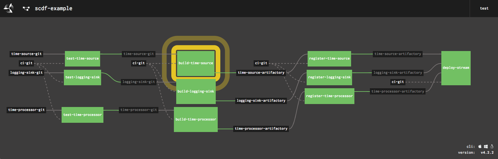

&nbsp;

## Breakdown of CI Folder Files
ci /  
&nbsp;&nbsp;&nbsp;&nbsp; [pipeline.yml](ci/pipeline.yml)  - Main pipeline file for Concourse    
&nbsp;&nbsp;&nbsp;&nbsp; [test.yml](ci/test.yml)  - Test task, runs `test-spring.sh`  
&nbsp;&nbsp;&nbsp;&nbsp; [test-spring.sh](ci/test-spring.sh)  - Runs `gradlew tests` for a given project path  
&nbsp;&nbsp;&nbsp;&nbsp; [build.yml](ci/build.yml)  - Build task, runs `build-spring.sh`   
&nbsp;&nbsp;&nbsp;&nbsp; [build-spring.sh](ci/build-spring.sh)  - Runs `gradlew build` for a given project path  
&nbsp;&nbsp;&nbsp;&nbsp; [register.yml](ci/register.yml)  - Register task, runs `register.sh`  
&nbsp;&nbsp;&nbsp;&nbsp; [register.sh](ci/register.sh)  - Registers a given URI of a stream app to a given Dataflow server  
&nbsp;&nbsp;&nbsp;&nbsp; [deploy-stream.yml](ci/deploy-stream.yml)  - Deploy task, runs `deploy-stream.sh`  
&nbsp;&nbsp;&nbsp;&nbsp; [deploy-stream.sh](ci/deploy-stream.sh)  - Undeploys a given stream name from a given Dataflow server, then attempt to deploy the stream again. On a failure, attempts to create the stream from DSL, and deploy it.  

&nbsp;

## Plus Goals

- Add a set of acceptance tests for a deployed stream and add it as a verification step on Concourse.
- Integrate with [Spring Cloud Sleuth](https://spring.io/projects/spring-cloud-sleuth) and [Zipkin](https://zipkin.io/) for observability and traceablility.

&nbsp;

## Resources

[Spring Cloud Data Flow - Spring.io](https://cloud.spring.io/spring-cloud-dataflow/#quick-start)  
[Spring Cloud Stream - Spring.io](https://cloud.spring.io/spring-cloud-stream/)  
[Spring Cloud Data Flow Reference Guide](http://docs.spring.io/spring-cloud-dataflow/docs/current/reference/htmlsingle/)  
[Spring Cloud Data Flow Reference Guide - REST API Guide](https://docs.spring.io/spring-cloud-dataflow/docs/current/reference/htmlsingle/#api-guide)  
[DevNexus 2018: Continuous Delivery for Data Pipelines](https://github.com/sabbyanandan/xfmr)  
[Webinar: Cloud-native patterns for Data-intensive applications](https://www.youtube.com/watch?v=n6fS-KmN0zI&feature=youtu.be)  
[Getting Started with Stream Processing with Spring Cloud Data Flow - Baeldung](https://www.baeldung.com/spring-cloud-data-flow-stream-processing)  
[Artifactory OSS](https://jfrog.com/open-source/)  
[Concourse Artifactory Resource - Pivotal Services](https://github.com/pivotalservices/artifactory-resource)  
